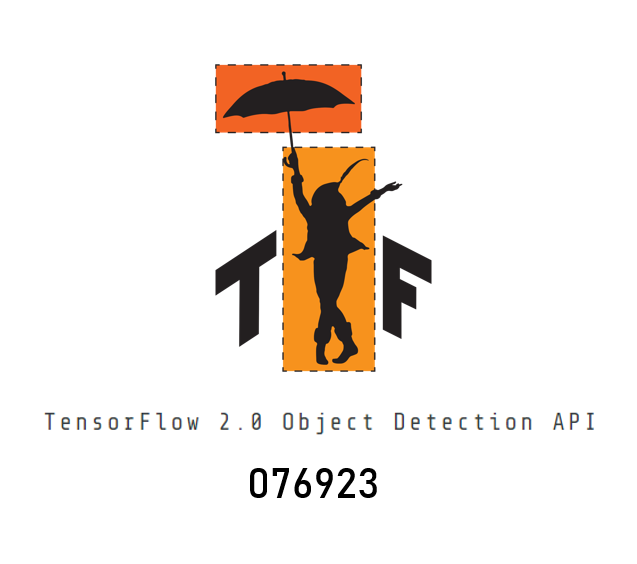
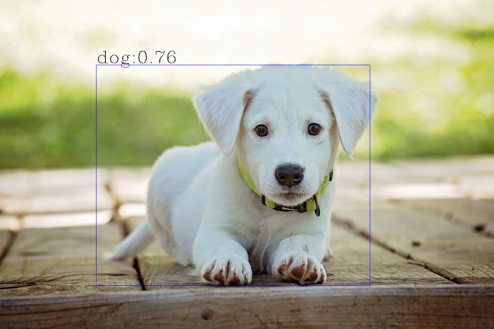
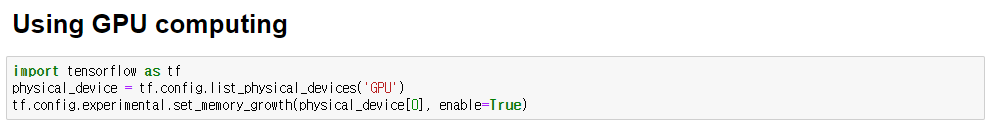
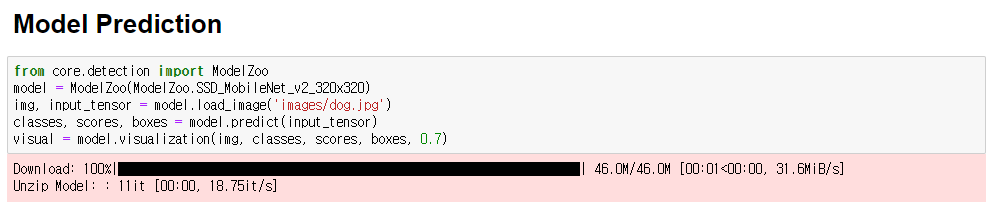
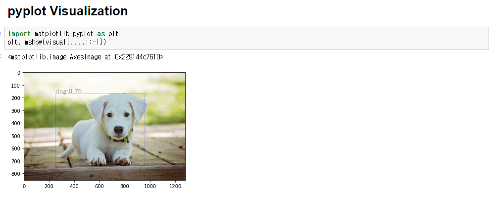

# TensorFlow 2.0 Object Detection API

 

1. 모델 파일을 자동으로 다운로드합니다.
2. OpenCV를 활용하여 이미지를 입력받습니다.
3. 검출된 `classes`, `scores`, `boxes`를 반환합니다.
4. 간단한 시각화를 지원합니다.

<br>

## Requirements

[](https://www.python.org/downloads/release/python-380/)
[](https://github.com/tensorflow/tensorflow/releases/tag/v2.3.0)
[](https://grpc.io/docs/protoc-installation/#install-using-a-package-manager)
[](https://github.com/tensorflow/tensorflow/releases/tag/v2.2.0)
[](https://grpc.io/docs/protoc-installation/#install-using-a-package-manager)

<br>

## Installation

Clone the TensorFlow 2.0 Object Detection API repository.

    git clone https://github.com/076923/Tensorflow-2.0-Object-Detection-API.git

<br>

## Using

```python3

# Using GPU computing
import tensorflow as tf
physical_device = tf.config.list_physical_devices('GPU')
tf.config.experimental.set_memory_growth(physical_device[0], enable=True)

# Model Prediction
from core.detection import ModelZoo
model = ModelZoo(ModelZoo.SSD_MobileNet_v2_320x320)
img, input_tensor = model.load_image('images/dog.jpg')
classes, scores, boxes = model.predict(input_tensor)
visual = model.visualization(img, classes, scores, boxes, 0.7)

# OpenCV Visualization
import cv2
cv2.imshow("visual", visual)
cv2.waitKey()

```

| src | dst |
|:---:|:---:|
|  |  |

<br>
<br>





<br>

## Model List

- ModelZoo.CenterNet_Resnet50_V1_FPN_512x512
- ModelZoo.CenterNet_Resnet101_V1_FPN_512x512
- ModelZoo.CenterNet_Resnet50_V2_512x512
- ModelZoo.CenterNet_MobileNetV2_FPN_512x512
- ModelZoo.EfficientDet_D0_512x512
- ModelZoo.EfficientDet_D1_640x640
- ModelZoo.EfficientDet_D2_768x768
- ModelZoo.EfficientDet_D3_896x896
- ModelZoo.EfficientDet_D4_1024x1024
- ModelZoo.EfficientDet_D5_1280x1280
- ModelZoo.EfficientDet_D6_1280x1280
- ModelZoo.EfficientDet_D7_1536x1536
- ModelZoo.SSD_MobileNet_v2_320x320
- ModelZoo.SSD_MobileNet_V1_FPN_640x640
- ModelZoo.SSD_MobileNet_V2_FPNLite_320x320
- ModelZoo.SSD_ResNet50_V1_FPN_640x640_RetinaNet50
- ModelZoo.SSD_ResNet50_V1_FPN_1024x1024_RetinaNet50	
- ModelZoo.SSD_ResNet101_V1_FPN_640x640_RetinaNet101
- ModelZoo.SSD_ResNet101_V1_FPN_1024x1024_RetinaNet101
- ModelZoo.SSD_ResNet152_V1_FPN_640x640_RetinaNet152	
- ModelZoo.SSD_ResNet152_V1_FPN_1024x1024_RetinaNet152	
- ModelZoo.Faster_RCNN_ResNet50_V1_640x640
- ModelZoo.Faster_RCNN_ResNet50_V1_1024x1024
- ModelZoo.Faster_RCNN_ResNet50_V1_800x1333
- ModelZoo.Faster_RCNN_ResNet101_V1_640x640
- ModelZoo.Faster_RCNN_ResNet101_V1_1024x1024
- ModelZoo.Faster_RCNN_ResNet101_V1_800x1333
- ModelZoo.Faster_RCNN_ResNet152_V1_640x640
- ModelZoo.Faster_RCNN_ResNet152_V1_1024x1024
- ModelZoo.Faster_RCNN_ResNet152_V1_800x1333

<br>

## Test Models

- ModelZoo.CenterNet_Resnet101_V1_FPN_512x512
- ModelZoo.SSD_MobileNet_v2_320x320
- ModelZoo.SSD_ResNet50_V1_FPN_640x640_RetinaNet50

<br>

## Model Zoo

We provide a large collection of models that are trained on COCO 2017 in the Model Zoo.

<br>

## Authors

윤대희(s076923@gmail.com)

<br>

## License

Apache License 2.0